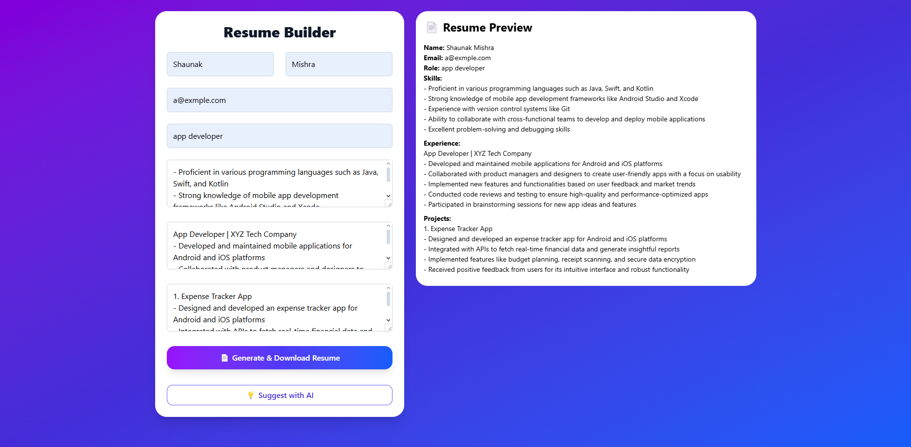

# 📝 Resume Builder

Create stunning, AI-assisted resumes in seconds. Built with **Next.js**, **Tailwind CSS**, and designed for simplicity and performance.



---

## 🚀 Features

- ✨ Modern and responsive UI  
- ⚛️ Built with Next.js App Router  
- 📂 Data handling with local state  
- 📄 Ready for export to PDF (future feature)

---

## 🛆 Tech Stack

- [Next.js 14 (App Router)](https://nextjs.org/)
- [Tailwind CSS](https://tailwindcss.com/)
- React 18

---

## 🛠️ Getting Started

1. **Clone the repo**:

   ```bash
   git clone https://github.com/ShaunakMishra25/Resume-Builder.git
   cd Resume-Builder
   ```

2. **Install dependencies**:

   ```bash
   npm install
   ```

3. **Run the development server**:

   ```bash
   npm run dev
   ```

4. **Open in browser**:

   Visit [Resume-Builder](https://resume-builder-theta-jade.vercel.app)

---

## 📁 Project Structure

```
src/
├── app/                  # App Router structure
│   ├── layout.tsx        # Root layout with custom logo
│   └── page.tsx          # Main entry page
├── components/           # Form and reusable components
├── public/               # Static assets (your logo, etc.)
└── styles/               # Global CSS
```

---

## 🖼️ Customization

- To **change the logo**, replace `public/logo.png` with your PNG file.
- Update theme, fonts, or layout easily via Tailwind classes.

---

## 🧠 Future Improvements

- ✅ Export as PDF / DOCX
- ✅ AI-powered content suggestions
- ✅ Form validation & templates

---

## 📄 License

MIT License

---

Made with ❤️ by [Shaunak Mishra](https://github.com/ShaunakMishra25)
